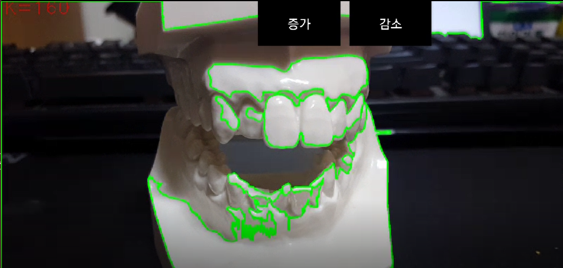
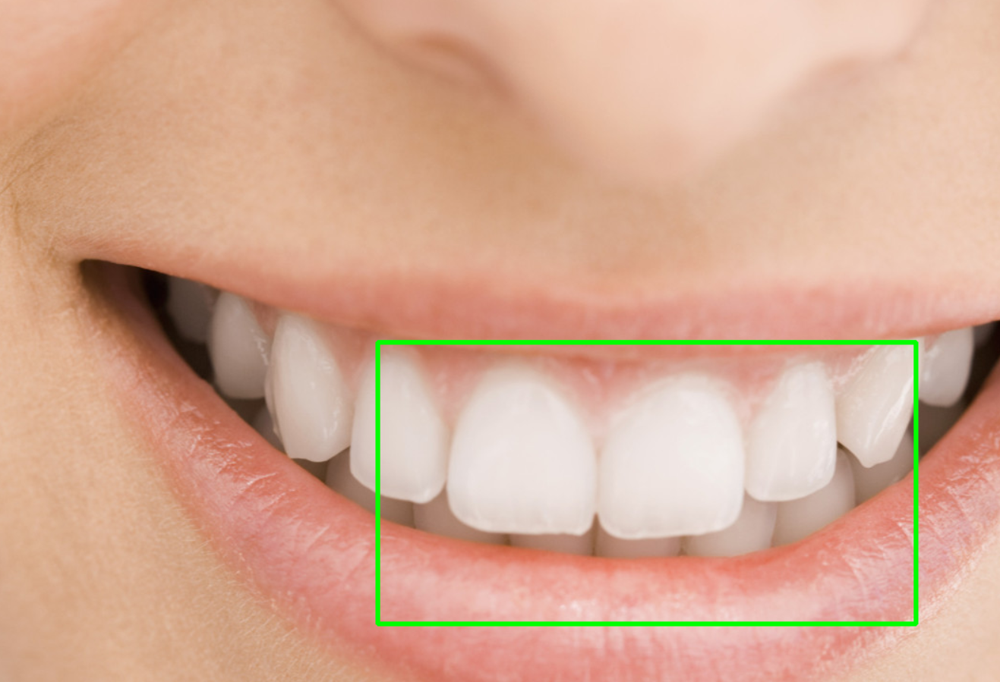

# Teeth Detector AR System 

>This is teeth detector program using opencv for dentist!
>I hope to make it doing on AR machines or AR systems.
### 1.Usage
```javascript
TeethAR [filename] [K;value of color] [D;reconginition dist] [DebugMode; 1 or 0]

_ TeethAR image.jpg 200 100 1
```
- filename : This is image filename that you want to detect.
- K : If value of RGB colors bigger than K, the sets include these positions.
- D : The sets combine elements gethered together at a distance less than the D.
- DebugMode : 1 set, you can see 2 debug pictures and 0 set, you can see only a detect picture.

### 2.Screenshot






### 3. Contact
- GitHub(http://github.com/nar789)
- Email(mailto:tony92511@hanmail.net)

>Thank you for your interest.
>Copyright all rights reserved by 2017 Hume corp.
